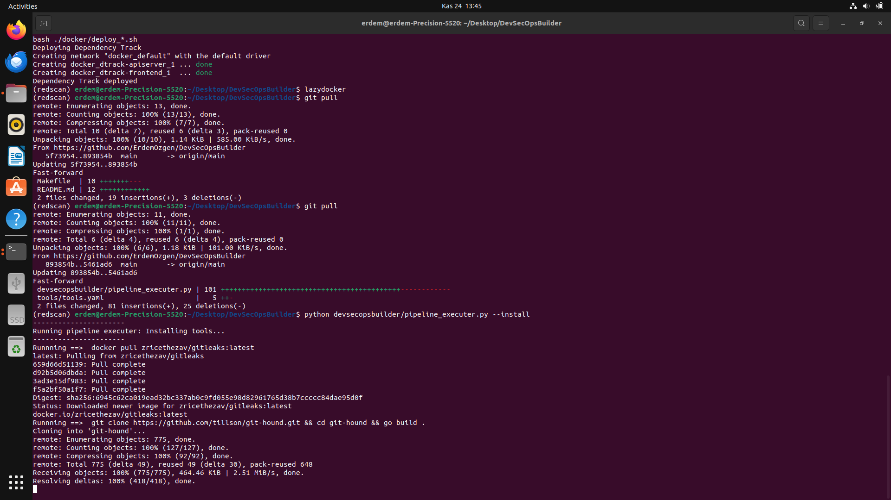
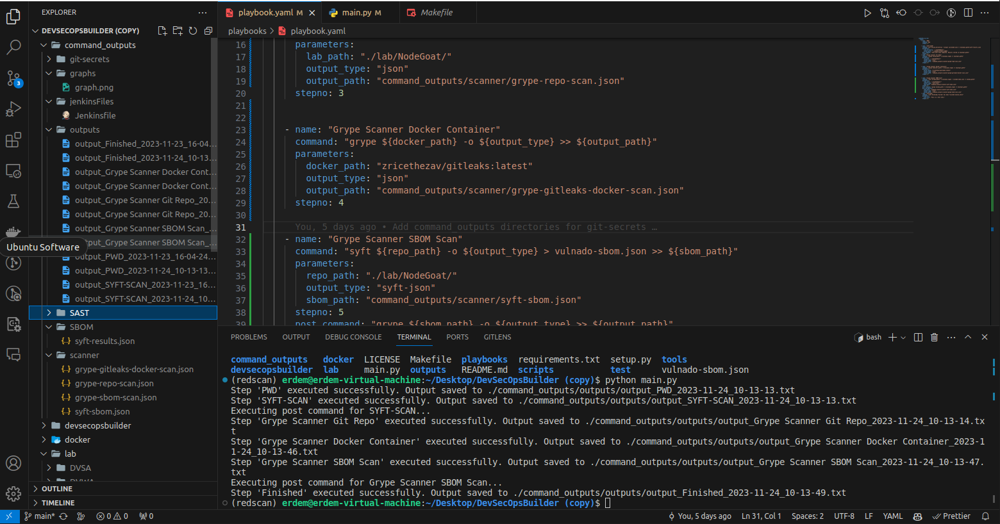
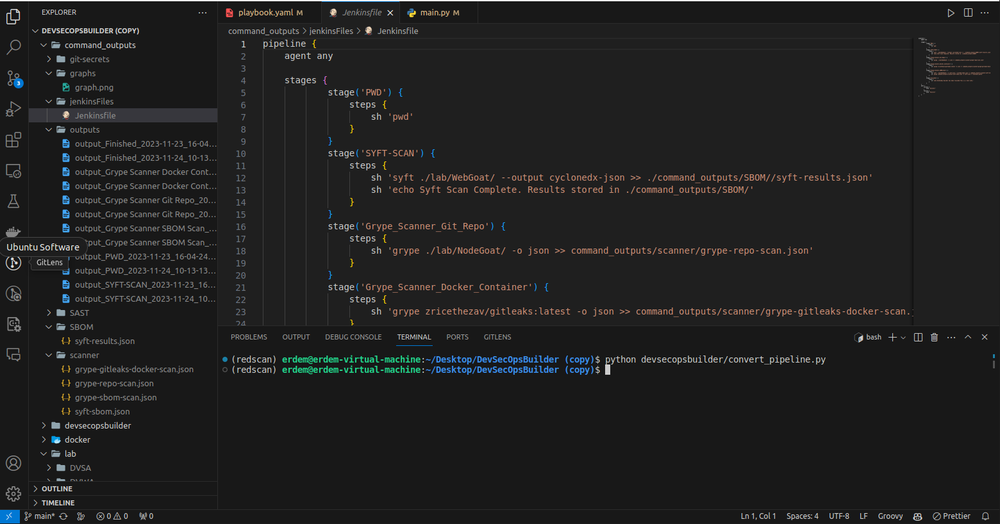
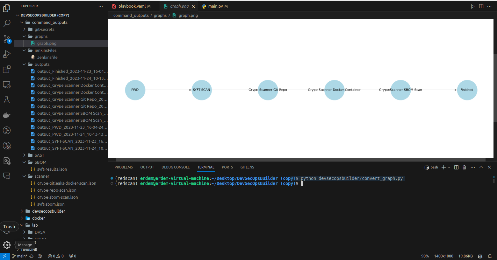

# DevSecOpsBuilder

## Overview

DevSecOpsBuilder is a comprehensive toolset designed for setting up and testing DevSecOps environments. It automates the installation of essential software and libraries using Makefile, Dockerfile, and Python scripts, thus creating a robust testbed for DevSecOps practices. This solution simplifies the process of establishing a DevSecOps pipeline, facilitating the integration and testing of various security practices within development workflows.

**Note**: DevSecOpsBuilder is intended for testing and development purposes only and is not recommended for production use.

## System Requirements

Tested on Ubuntu 22.04 LTS:
- **CPU**: Intel i7-7820HQ
- **RAM**: 32GB
- **Disk**: 500 GB SSD

## Features

1. **YAML-Based Pipeline Creation**: Easy construction of DevSecOps pipelines using YAML files.
2. **Predefined YAML Templates**: Includes templates for SAST, DAST, SCA, and secret scanning.
3. **Execution and Logging**: Execute custom or predefined `playbook.yaml` and view logs using `python main.py`.
4. **Jenkinsfile Generation**: Automates Jenkinsfile creation from YAML configurations.
5. **Visualization Tools**: Generates graphical views of YAML and Jenkinsfile for easy understanding.
6. **Docker Container Deployment**: Supports Docker deployment for key DevSecOps tools.
7. **GitHub Integration**: Facilitates cloning from GitHub for testing in a controlled environment.

## Getting Started

### Prerequisites

- make
- git

### Pre-Installation

For Ubuntu 22.04 setup:

```bash
sudo apt install git -y && sudo apt install make -y
   ```

### Installation

1. Clone the DevSecOpsBuilder repository:
   ```bash
   git clone https://github.com/ErdemOzgen/DevSecOpsBuilder.git
   ```

2. Navigate to the repository directory:
   ```bash
   cd DevSecOpsBuilder
   ```

3. Run the setup script:
   ```bash
   make setup
   ```

4. Run the lab script: (This will download test repos)
   ```bash
   make lab
   ```

5. Run pip install and update .bashrc
   ```bash
   source ~/.bashrc
   pip install -r requirements.txt
   reboot
   ```
6. Pull and run docker containers
   ```bash
   make up
   # You can close after all containers pulled
   make down
   ```
7. Install tools/tools.yaml You can select with which tools you need to install just change **default** parameter.
	```bash
	#python devsecopsbuilder/pipeline_executer.py --install #old way
	python main.py --install
	# If you want to update you can use 
	python main.py --update
	```

```yaml
- name: sonarqube
  install: docker pull sonarqube:latest && sudo sysctl -w vm.max_map_count=524288 && sudo sysctl -w fs.file-max=131072 && ulimit -n 131072 && ulimit -u 8192
  update: docker pull sonarqube:latest
  help: echo "Running in docker  not need help"
  default: false # This tool wont be install
  language:
    - "All"
  devsecops:
    name: sonarqube
    description: "SonarQube is an open-source platform for continuous inspection of code quality."
    category: "SAST"
    url: https://github.com/SonarSource/sonarqube
```



8. You can see all options with default **python main.py** call

```


╭━━━╮╱╱╱╱╱╭━━━╮╱╱╱╱╱╭━━━╮╱╱╱╱╱╭━━╮╱╱╱╱╭╮╱╱╭╮
╰╮╭╮┃╱╱╱╱╱┃╭━╮┃╱╱╱╱╱┃╭━╮┃╱╱╱╱╱┃╭╮┃╱╱╱╱┃┃╱╱┃┃
╱┃┃┃┣━━┳╮╭┫╰━━┳━━┳━━┫┃╱┃┣━━┳━━┫╰╯╰┳╮╭┳┫┃╭━╯┣━━┳━╮
╱┃┃┃┃┃━┫╰╯┣━━╮┃┃━┫╭━┫┃╱┃┃╭╮┃━━┫╭━╮┃┃┃┣┫┃┃╭╮┃┃━┫╭╯
╭╯╰╯┃┃━╋╮╭┫╰━╯┃┃━┫╰━┫╰━╯┃╰╯┣━━┃╰━╯┃╰╯┃┃╰┫╰╯┃┃━┫┃
╰━━━┻━━╯╰╯╰━━━┻━━┻━━┻━━━┫╭━┻━━┻━━━┻━━┻┻━┻━━┻━━┻╯
╱╱╱╱╱╱╱╱╱╱╱╱╱╱╱╱╱╱╱╱╱╱╱╱┃┃
╱╱╱╱╱╱╱╱╱╱╱╱╱╱╱╱╱╱╱╱╱╱╱╱╰╯                                         

usage: main.py [-h] [--install] [--update] [--execute] [--config CONFIG] [--output_dir OUTPUT_DIR] [--tools_config TOOLS_CONFIG] [--generate_graph] [--graph_yaml GRAPH_YAML]
               [--graph_output_dir GRAPH_OUTPUT_DIR] [--convert_pipeline] [--pipeline_yaml PIPELINE_YAML] [--pipeline_output_dir PIPELINE_OUTPUT_DIR]

Pipeline Execution Script

options:
  -h, --help            show this help message and exit
  --install             Install tools
  --update              Update tools
  --execute             Execute commands from playbook
  --config CONFIG       Path to configuration file
  --output_dir OUTPUT_DIR
                        Path to output directory
  --tools_config TOOLS_CONFIG
                        Path to tools configuration file
  --generate_graph      Generate graph of defined yaml workflow
  --graph_yaml GRAPH_YAML
                        Path to yaml file for generating graph
  --graph_output_dir GRAPH_OUTPUT_DIR
                        Path to graph output directory
  --convert_pipeline    Convert yaml to pipeline
  --pipeline_yaml PIPELINE_YAML
                        Path to workflow yaml file to pipeline
  --pipeline_output_dir PIPELINE_OUTPUT_DIR
                        Path to pipeline output directory

```


### Usage

1. Choose or create a playbook YAML file based on your testing requirements.

2. Run the main script to start the pipeline:
   ```bash
   python main.py --execute
   ```

3. Follow the on-screen instructions to view outputs and logs.

To include a guide on how to use the `playbook.yaml` file in your README.md, you can incorporate the following explanation. This guide will help users understand the structure and functionality of the playbook and how to customize it for their needs.

```markdown
## Using the playbook.yaml

The `playbook.yaml` file is a crucial part of the DevSecOpsBuilder, defining the sequence of commands and actions to be executed in your DevSecOps pipeline. Here's how you can use and understand it:

### Structure of playbook.yaml

The playbook is composed of a series of steps, each representing a command to be executed. Here's an example of what a typical step looks like:

```yaml
- name: "Step Name"
  command: "executable command"
  parameters:
    param1: "value1"
    param2: "value2"
  post_command: "command after the main command"
  post_parameters:
    post_param1: "value1"
    post_param2: "value2"
  stepno: Step Number

```

- `name`: A descriptive name for the step.
- `command`: The main command to be executed.
- `parameters`: Key-value pairs that provide additional parameters to the command. (Optinal)
- `post_command`: An optional command to be executed after the main command.(Optinal)
- `post_parameters`: Key-value pairs that provide additional parameters to the post command.(Optinal)
- `stepno`: The step number, for ordering and reference.

** **You dont need to use always **parameters** and **post_parameters** but if you do you can use as baseplate for all devsecops process.**


### Customizing playbook.yaml

You can customize the playbook according to your project needs. For instance:

1. **Change Commands**: Replace the command in each step with the one you need to execute. For example, change `pwd` to any other command like `ls`.

2. **Modify Parameters**: Adjust the `parameters` for each command to suit your environment or requirements. For example, change `scan_directory` to the directory you want to scan.

3. **Add or Remove Steps**: You can add new steps or remove existing ones. To add a new step, copy the format of an existing step and modify it accordingly.

4. **Reorder Steps**: Change the `stepno` values to reorder the steps. Ensure that the steps are in the sequence you want them to be executed.

### Example Usage

Let's break down the example given in the playbook:

- **Step 1 - PWD**: This step executes the `pwd` command, showing the current working directory.

- **Step 2 - SYFT-SCAN**: Performs a Syft scan on the specified directory and saves the results in JSON format.

- **Step 3 - Grype Scanner Git Repo**: Runs Grype scan on a specified git repository and outputs the results in JSON format.

- **Step 4 - Grype Scanner Docker Container**: Executes Grype scan on a Docker container.

- **Step 5 - Grype Scanner SBOM Scan**: First generates a Software Bill of Materials (SBOM) with Syft, then runs a Grype scan on it.

- **Step 6 - Finished**: Echoes a custom message indicating the completion of the DevSecOps Builder process.

```yaml
commands_to_run:
  steps:
    - name: "PWD"
      command: pwd
      stepno: 1

    - name: "SYFT-SCAN"
      command: syft ${scan_directory} --output cyclonedx-json >> ${output_path}/syft-results.json
      parameters:
        scan_directory: "./lab/WebGoat/"
        output_path: "./command_outputs/SBOM/"
      post_command: "echo Syft Scan Complete. Results stored in ${output_path}"
      stepno: 2
    - name: "Grype Scanner Git Repo"
      command: "grype ${lab_path} -o ${output_type} >> ${output_path}"
      parameters:
        lab_path: "./lab/NodeGoat/"
        output_type: "json"
        output_path: "command_outputs/scanner/grype-repo-scan.json"
      stepno: 3
          

    - name: "Grype Scanner Docker Container"
      command: "grype ${docker_path} -o ${output_type} >> ${output_path}"
      parameters:
        docker_path: "zricethezav/gitleaks:latest"
        output_type: "json"
        output_path: "command_outputs/scanner/grype-gitleaks-docker-scan.json"
      stepno: 4
      

    - name: "Grype Scanner SBOM Scan"
      command: "syft ${repo_path} -o ${output_type} > vulnado-sbom.json >> ${sbom_path}"
      parameters:
        repo_path: "./lab/NodeGoat/"
        output_type: "syft-json"
        sbom_path: "command_outputs/scanner/syft-sbom.json"
      stepno: 5
      post_command: "grype ${sbom_path} -o ${output_type} >> ${output_path}"
      post_parameters:
        sbom_path: "command_outputs/scanner/syft-sbom.json"
        output_type: "json"
        output_path: "command_outputs/scanner/grype-sbom-scan.json"
    - name: "Finished"
      command: "echo DevSecOps Builder has been finished ${echo_text}"
      parameters:
        echo_text: "This is a test echo."
      stepno: 6

```


### Running the Playbook

To run the playbook, execute the `main.py` script in your DevSecOpsBuilder setup:

```bash
python main.py --execute
```

This will sequentially execute the steps defined in your `playbook.yaml`, automating your DevSecOps pipeline process.

Remember, you can always tailor the playbook to better fit your project's requirements. Experiment with different commands and configurations to optimize your DevSecOps workflow.





```bash
#python devsecopsbuilder/convert_pipeline.py
python main.py --convert_pipeline
```

This will convert existing yaml file to Jenkinsfile. 



* Generated Jenkinsfile
```groovy
pipeline {
    agent any

    stages {
            stage('Start') {
                steps {
                    sh 'echo "Welcome to DevSecOpsBuilder"'
                }
            }
        stage('Step_2') {
            parallel {
            stage('List_files') {
                steps {
                    sh 'ls -l'
                }
            }
            stage('Get_current_directory') {
                steps {
                    sh 'pwd'
                }
            }
            }
        }
            stage('GITLEAK-JOB') {
                steps {
                    sh 'docker run -v ./lab/SecretsTest/:/path zricethezav/gitleaks:latest detect --source="/path" --verbose --report-format=json --report-path=/path/gitleaks_report.json'
                    sh 'mv ./lab/SecretsTest/gitleaks_report.json ./outputs/git-secrets/'
                }
            }
            stage('TRUFFLEHOG-JOB') {
                steps {
                    sh 'trufflehog git file://./lab/SecretsTest/ --json >> ./lab/SecretsTest/trufflehog_result.json'
                    sh 'mv ./lab/SecretsTest/trufflehog_result.json ${output_path}'
                }
            }
            stage('DETECT-SECRETS-SCAN') {
                steps {
                    sh 'detect-secrets scan ./lab/SecretsTest/ >> ./command_outputs/git-secrets//detect-secrets-results.json'
                    sh 'echo Scan Complete. Results stored in ./command_outputs/git-secrets/'
                }
            }
            stage('SYFT-SCAN') {
                steps {
                    sh 'syft ./lab/WebGoat/ --output cyclonedx-json >> ./command_outputs/SBOM//syft-results.json'
                    sh 'echo Syft Scan Complete. Results stored in ./command_outputs/SBOM/'
                }
            }
        stage('Step_7') {
            parallel {
            stage('Dependencytrack') {
                steps {
                    sh 'cd /tmp && curl -LO https://dependencytrack.org/docker-compose.yml && docker-compose up -d'
                    sh 'cd /tmp && docker-compose down'
                }
            }
            stage('Finished') {
                steps {
                    sh 'echo DevSecOps Builder has been finished This is a test echo.'
                }
            }
            }
        }
    }
    post {
        success {
            echo 'Success!'
        }
        failure {
            echo 'Failure!'
        }
    }
}

```

```bash
#python devsecopsbuilder/convert_graph.py 
python main.py --generate_graph
```

This will create graph representation of your pipeline.




## Contributing

Contributions to DevSecOpsBuilder are welcome! Please read our [contributing guidelines](./CONTRIBUTING.md) for more information on how to get involved.

## License

This project is licensed under [GNU GENERAL PUBLIC LICENSE]. See the [LICENSE](./LICENSE) file for more details.
